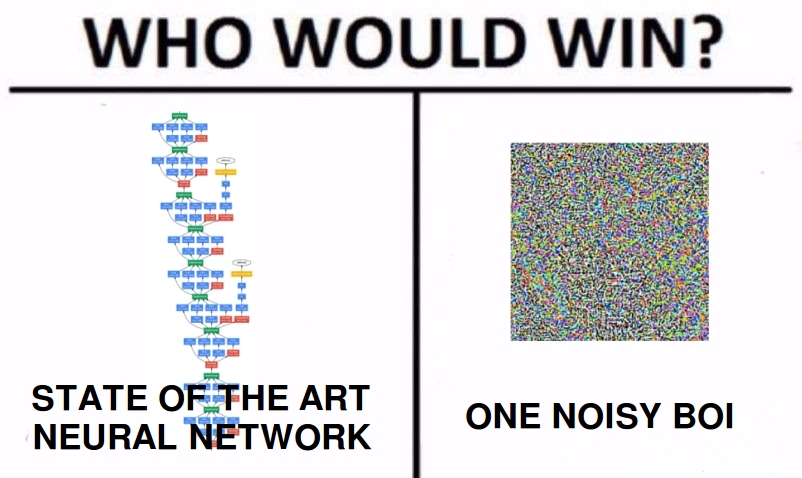

# Adversarial Examples Capstone Project

## Background about myself

I did not know anything about neural networks (NN) or deep learning before this project. Couldn't write a simple network before fall. During the beginning of this project, I learned how to code up NNs in keras.

## Intro

Welcome to the repo for my adversarial examples capstone project, for the Masters of Science in Mathematical Finance (MSMF) program. I made a jupyter notebook that was intended for deep learning beginners, which surveyed a couple of attacks, illustrated key properties of adversarial examples using toy examples, and visualized them.

For the notebook, please look in the [Final_notebook](https://github.com/calvinyong/adversarial_examples_capproj/blob/master/Final_notebook/Adversarial_Examples.ipynb) folder

11/12/18: Notebook is finished.
12/01/18: Moved from gitlab to github.
2/12/19: Add extra decision boundary pictures

## Contents of Repo

Adversarial_Code: Small notebooks experimenting with attacks

Adversarial_csvs: Transferability results

Final_notebook: The report for this project

Model_logs: Training history for the models

Practice_code: Notebooks of trying to implement basic NN architectures.

Sample_code: Code for building DNNs, mostly taken from Keras repo.

Scripts: Scripts used for training the models, getting the mini OIDv4 dataset, and getting the transferability results

Simple: Toy examples

Vizualizations: Trying to visualize layers with adversarial inputs

## Notes

Notebooks were ran using a GeForce 980. CNN models were made using my university's P100.

Keras models used in this project can be downloaded [here](https://drive.google.com/file/d/1xceMmw7CKhJ9mw8SkIbgCLNhH3JsdO-r/view?usp=sharing).

CIFAR10 code in Sample_code is from Keras github repo

See the `requirements.txt` file for what packages were used in the notebook.

## If I had more time

I could have done a better job in describing the adversarial attack methods. I rushed reading the papers. I would redo all of the attacks I've conducted since I made a mistake in running them (used model predictions rather than actual labels).

## Acknowledgements

Thanks to the UM CS department for letting me use the GPU server. Thanks to Rao Parlapalli for giving me the opportunity to study and explore this topic for my capstone project.

---

Meme from [here](https://ml.berkeley.edu/blog/2018/01/10/adversarial-examples/)

Black-box attacks, or good luck getting gradients out of your self-driving car
